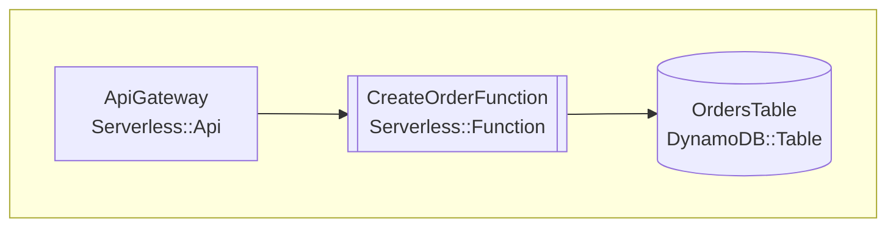

# aws_cloud_supporter

## コンセプト

AWSを使って構築しているクラウドアプリケーションの運用を支援するツール
基本的にCLIツールとして提供し、ビジュアライズはWebブラウザを利用する

## 現在の機能

### CloudFormationテンプレートのビジュアライゼーション（cfn-diagram）

[cfn-diagram](https://github.com/ljacobsson/cfn-diagram)を使用して、CloudFormation/SAM/CDKテンプレートを様々な形式の図に変換できます。

#### インストール

```bash
npm install -g @mhlabs/cfn-diagram
```

#### 基本的な使い方

```bash
# インタラクティブなHTML図を生成
cfn-dia html -t examples/web-application-stack.yaml

# Mermaid形式でMarkdownに埋め込み可能な図を生成
cfn-dia mermaid -t examples/serverless-api-sam.yaml

# Draw.io形式で編集可能な図を生成
cfn-dia draw.io -t examples/container-microservices-ecs.yaml
```

詳細な使い方は[usage-for-cfn-diagram.md](./usage-for-cfn-diagram.md)を参照してください。

## サンプルテンプレート（examples/）

様々なAWSアーキテクチャパターンのCloudFormationテンプレートを提供しています。これらはcfn-diagramでの可視化テストに使用でき、実際にAWSにデプロイ可能です。

### 提供テンプレート一覧

| テンプレート                                                                    | 説明                               | 主なリソース                             |
| ------------------------------------------------------------------------------- | ---------------------------------- | ---------------------------------------- |
| [basic-cloudformation.yaml](./examples/basic-cloudformation.yaml)               | 基本的なWebアプリケーション構成    | S3, Lambda, DynamoDB, API Gateway        |
| [web-application-stack.yaml](./examples/web-application-stack.yaml)             | 本格的な3層Webアプリケーション     | ALB, Auto Scaling, RDS, ElastiCache, VPC |
| [serverless-api-sam.yaml](./examples/serverless-api-sam.yaml)                   | イベント駆動型サーバーレスAPI      | SAM, EventBridge, SQS, SNS, DynamoDB     |
| [data-pipeline-analytics.yaml](./examples/data-pipeline-analytics.yaml)         | リアルタイムデータ分析パイプライン | Kinesis, Glue, Athena, S3, Lambda        |
| [container-microservices-ecs.yaml](./examples/container-microservices-ecs.yaml) | コンテナベースのマイクロサービス   | ECS Fargate, ALB, Service Discovery      |
| [static-website-hosting.yaml](./examples/static-website-hosting.yaml)           | 静的Webサイトホスティング          | S3, CloudFront, Route53, ACM, WAF        |

### 使用例

#### 1. テンプレートの可視化

```bash
# HTML形式で出力（ブラウザでインタラクティブに探索可能）
cfn-dia html -t examples/web-application-stack.yaml -o output/web-app
# ブラウザで output/web-app/index.html を開く

# Mermaid形式で出力（GitHubやドキュメントに埋め込み可能）
cfn-dia mermaid -t examples/serverless-api-sam.yaml > architecture.mmd

# Draw.io形式で出力（編集・カスタマイズ可能）
cfn-dia draw.io -t examples/container-microservices-ecs.yaml -o ecs.drawio
```

#### 2. AWSへのデプロイ

```bash
# 基本的なWebアプリケーション
aws cloudformation create-stack \
  --stack-name my-basic-app \
  --template-body file://examples/basic-cloudformation.yaml \
  --parameters ParameterKey=Environment,ParameterValue=dev \
  --capabilities CAPABILITY_IAM

# SAMアプリケーション（SAM CLIが必要）
cd examples
sam build --template serverless-api-sam.yaml
sam deploy --guided

# コンテナアプリケーション
aws cloudformation create-stack \
  --stack-name my-container-app \
  --template-body file://examples/container-microservices-ecs.yaml \
  --capabilities CAPABILITY_IAM
```

### 出力例

#### HTML出力

- インタラクティブなネットワーク図
- ノードのドラッグ＆ドロップ
- リソースタイプでのフィルタリング
- 詳細情報のツールチップ表示

#### Mermaid出力



### テンプレートの特徴

- **本番環境対応**: セキュリティ、可用性、スケーラビリティを考慮
- **ベストプラクティス**: AWS Well-Architectedフレームワークに準拠
- **パラメータ化**: 環境ごとの設定が容易
- **コメント付き**: リソースの役割と設定理由を説明
- **検証済み**: 文法エラーなし、デプロイ可能

## ロードマップ

1. ✅ CloudFormationからリソースを抽出してビジュアライズする（cfn-diagram統合）
2. CloudFormationからリソースを抽出して、それぞれのリソースがサポートしているメトリクスを一覧化する
3. CloudFormationからリソースを抽出して、それぞれのリソースがサポートしているメトリクスに対してアラームを張るためのCDKコードを生成する
4. CloudFormationからリソースを抽出して、それぞれのリソースがサポートしているメトリクスに対して張るアラームを選択できるようにする
5. CloudFormationからリソースを抽出して、コストを算出する
6. CloudFormationからリソースを抽出して、コストを最適化するための提案を行う
7. CDKにも対応する
8. Terraformにも対応する

## プロジェクト構成

```txt
aws_cloud_supporter/
├── README.md                      # このファイル
├── CLAUDE.md                      # Claude Codeの設定ファイル
├── usage-for-cfn-diagram.md       # cfn-diagramの詳細な使い方
├── visualization-tool-report.md   # ビジュアライゼーションツールの調査結果
├── cfn-diagram/                   # cfn-diagramのソースコード（参考用）
│   ├── commands/                  # 各種出力形式のコマンド実装
│   ├── graph/                     # グラフ生成ロジック
│   └── ...
└── examples/                      # CloudFormationテンプレート集
    ├── basic-cloudformation.yaml  # 基本的なWebアプリケーション
    ├── web-application-stack.yaml # 3層Webアプリケーション
    ├── serverless-api-sam.yaml    # サーバーレスAPI（SAM）
    ├── data-pipeline-analytics.yaml # データ分析パイプライン
    ├── container-microservices-ecs.yaml # ECSマイクロサービス
    ├── static-website-hosting.yaml # 静的サイトホスティング
    └── output/                    # 生成された可視化ファイル（例）
        ├── index.html
        ├── data.js
        └── icons.js
```
